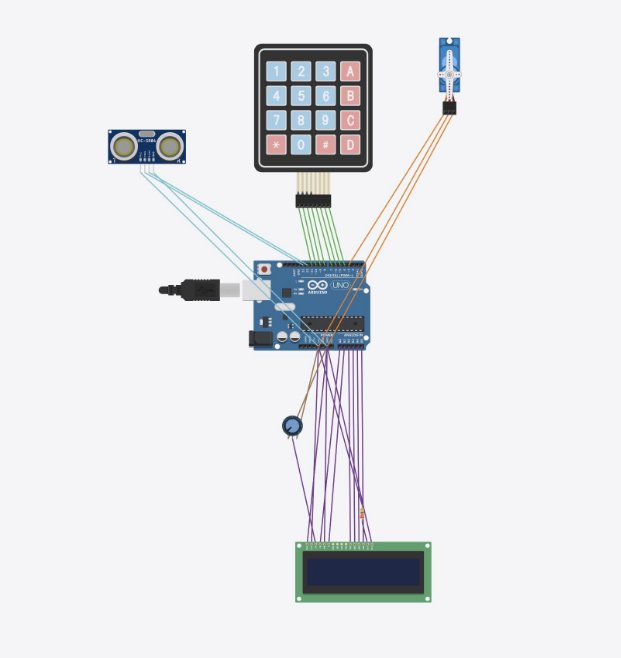
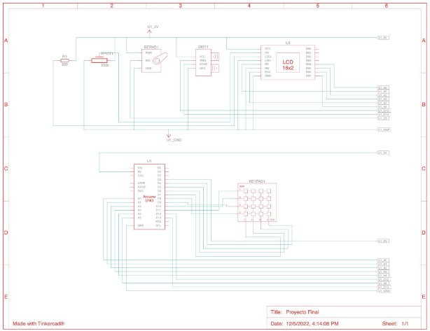
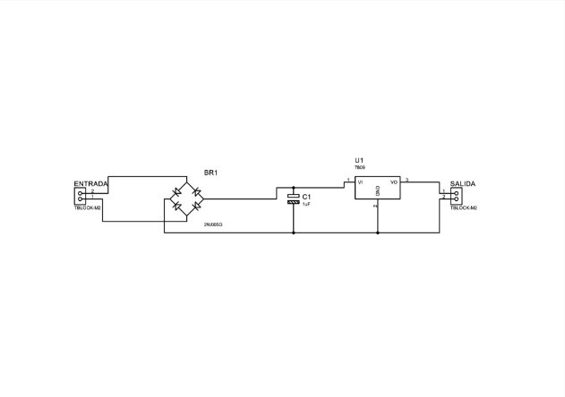
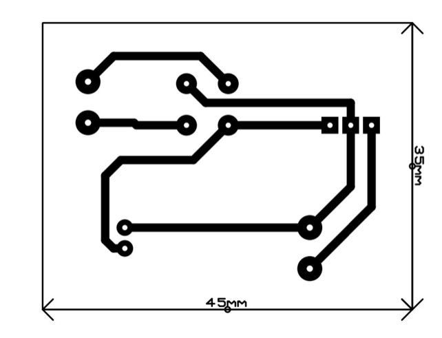

# Pet-Food-Dispenser

Universidad San Francisco de Quito   **Alimentando a nuestro seres queridos** Paula Campaña Donoso (00215572)   Juan Francisco Cisneros (00323665) Malena Loza

NRC: 2767

Fecha: 06/12/2022

**Antecedentes:**

Nos hemos dado cuenta que hoy en día las personas dejan de tener mascotas por falta de tiempo o tienen mascotas pero las tienen olvidadas en las mañanas y tardes debido a sus trabajos, volviéndose un problema que se piensa que no tiene solución. Con nuestro invento, nuestras mascotas serán alimentadas todos los días sin ayuda de externos, ahorrándole dinero y problemas a su dueño. Pero además existirá un ahorro y un control de la cantidad de comida suministrada diariamente a nuestras mascotas. Evitando así problemas hasta de obesidad para nuestros seres queridos, pero dará una alternativa para que los dueños de mascotas o las personas que deseen tener mascotas puedan cumplir este sueño.

**Descripción del Proyecto:**

Como proyecto de semestre queremos realizar automatización, hemos pensado en el problema que hoy en día significa dejar a nuestras mascotas en casa. Es por esto que queremos realizar un dispensador automático de comida para nuestros perros y gatos.

El dispensador será capaz de entregar comida cuando el dueño de la mascota le indique. Una compuerta inferior se abrirá entonces para poder soltar la porción de comida indicada por el usuario en una cantidad de tiempo también especificada por el usuario.

Con esto estaríamos solucionando entonces el problema de no querer mascota por falta de tiempo pero también estaríamos ayudando a todos esos dueños de mascotas que dejan por varias horas a sus seres queridos en casas o departamentos.

**Objetivos:**

- Crear un sistema de automatización para alimentar a nuestras mascotas
- Crear un sistema eficiente que controle la cantidad de comida que se distribuye
- Permitir que el sistema tenga una opción de tiempo que permita poner horario al momento de distribuir comida
- Crear un sistema que visualmente se vea atractivo para las casas modernas

**Diseño electrónico (Diagrama de conexiones mostrando la interacción entre Arduino y los demás elementos):**

Imagen No. 1: Diseño electrónico que muestra la interacción entre todos los elementos y el Arduino

Imagen No. 2: Diseño electrónico que también muestra la interacción entre los elementos y Arduino visto desde otros planos

**Diseño eléctrico (Diagrama de la placa de la fuente):**

Imagen No. 3: Diagrama de la placa mostrando todos los elementos

Imagen No. 4: Diagrama de la placa mostrando dimensiones de la misma **Lista de Piezas y materiales y Presupuesto real a detalle:**

|**MATERIALES**|**$**|
| - | - |
|ARDUINO UNO|26|
|SENSOR ULTRASONICO|3|
|SERVO MOTOR|4|
|TECLADO|5|

|LCD|10|
| - | - |
|CARTON|5|
|PINTURA DE COLOR|4|
|PINCELES|2|
|**TOTAL**|59|
**Manual de interacción y mantenimiento:**

Antes de comenzar debemos llenar la tolva principal de comida para ser servida, podemos utilizar la que más queramos. Procedemos a conectar la planta a la corriente para iniciar con el seteo inicial.

Para el funcionamiento de nuestro proyecto se ha implementado un menú inicial al que el usuario llegará después del primer encendido de nuestra planta. En el mismo el usuario tendrá que elegir mediante el uso del teclado la opción 1 o 2.

En caso de que el usuario elige la primera opción “Seteo inicial”, en la pantalla se mostrará un proceso sencillo e intuitivo para poder configurar la cantidad de comida a servir en centímetros y seguidamente el usuario tiene la opción de setear cada cuantos minutos quiere que la comida sea servida. Una vez se realiza el seteo comienza automáticamente el menú 2 a funcionar comenzando la actividad automática de la planta, sirviendo la comida a su mascota.

En caso de elegir la opción 2 “Comenzar”, en la pantalla se mostrará un mensaje informativo de que se ha seteado los valores por defecto, 3cm de comida cada 1 minuto. La planta comienza su actividad automática, sirviendo la comida a su mascota.

Como mantenimiento debemos mantener lo más limpio a nuestra planta para que funcione siempre de la mejor manera, no debemos obstruir motores ni sensores. Se debe rellenar de alimento la tolva cada que se vea escasez del mismo en la misma.

**Conclusiones:**

Una vez terminada la creación de este prototipo, con el código fuente, las conexiones eléctricas y la construcción de la planta nos hemos dado cuenta que es funcional y eficiente para cumplir con el propósito inicial el cual queríamos solucionar. Además nos dimos cuenta que no se limita a un solo tipo de plato, ya que, damos la opción de poner la cantidad de comida que se quiere dar a cada mascota, por lo que muestra más opciones para las personas que quisieran utilizarlo.

Utilizamos materiales como el cartón que no son dañinos para nuestras mascotas porque no solo queríamos crear un dispensador de comida pero queríamos crear un producto que se vea bonito a la vista y que tenga un propósito. Por esa razón nuestra creación puede ser pintada de diferentes colores y tener diseños únicos para atraer a nuestras mascotas a que disfruten de su comida recien servida con nuestro prototipo.

Cada paso que se daba para la creación de este producto nos enseñaba algo nuevo, como la creación de la fuente, las conexiones que se debían hacer para que todo funcione y por último el uso de un software como lo fue Arduino, cada uno de estos elementos fueron conectados, perfeccionados y revisados para que sean lo más eficientes posibles dando así una gran solución para nuestro problema principal.

**Bibliografía:**

*Interfacing 4x4 Keypad, LCD And GSM With Arduino(HOME SECUR*. (2019, July 2). Web

Editor. Retrieved December 5, 2022, from [https://create.arduino.cc/projecthub/ARDUICREATE/interfacing-4x4-keypad-lcd-and-gs m-with-arduino-home-secur-5d0cd9](https://create.arduino.cc/projecthub/ARDUICREATE/interfacing-4x4-keypad-lcd-and-gsm-with-arduino-home-secur-5d0cd9)

Jabbaar, A. A. (2019, September 17). *Ultrasonic Sensor HC-SR04 with Arduino Tutorial*. Web

Editor. Retrieved December 5, 2022, from [https://create.arduino.cc/projecthub/abdularbi17/ultrasonic-sensor-hc-sr04-with-arduino-t utorial-327ff6](https://create.arduino.cc/projecthub/abdularbi17/ultrasonic-sensor-hc-sr04-with-arduino-tutorial-327ff6)

*Liquid Crystal Displays (LCD) with Arduino | Arduino Documentation*. (2022, November 23).

Arduino. Retrieved December 5, 2022, from <https://docs.arduino.cc/learn/electronics/lcd-displays>

MISHRA, S. V. (2020, April 17). *Servo Motor Interface with Arduino Uno - Arduino Project*

*Hub*. Web Editor. Retrieved December 5, 2022, from [https://create.arduino.cc/projecthub/akshayjoseph666/servo-motor-interface-with-arduino -uno-9693ad](https://create.arduino.cc/projecthub/akshayjoseph666/servo-motor-interface-with-arduino-uno-9693ad)
